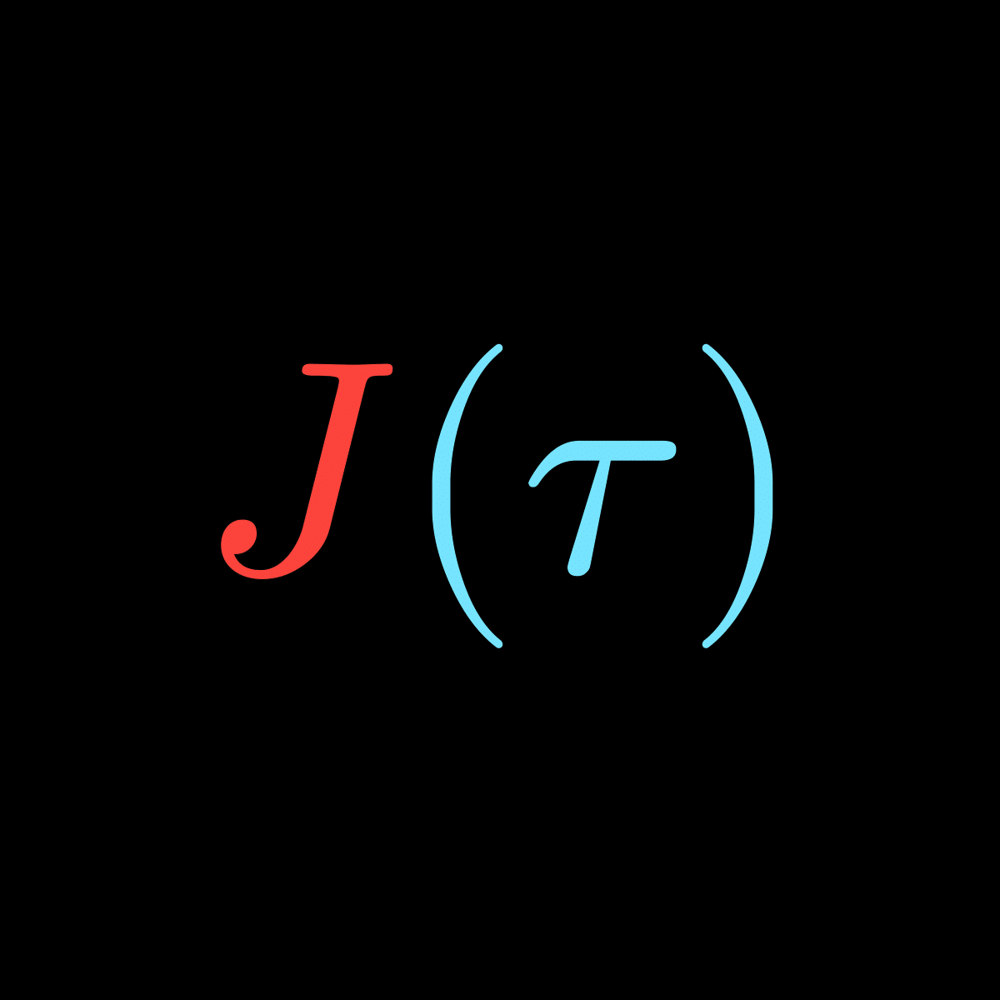

    

# Welcome to JTau!

## Introduction

JTau is a java-math library <u> still under development!</u> Currently, I have
been working specifically on the linear algebra part of JTau, but soon, some more advanced
mathematical concepts may also be implemented. Java is perfect for a library like this, due to
its object-oriented nature, and efficiency. Though a library like this could have a much
better performance in a lower level language like C++, <u>JTau is not
designed to be used for extremely expensive computations!</u>